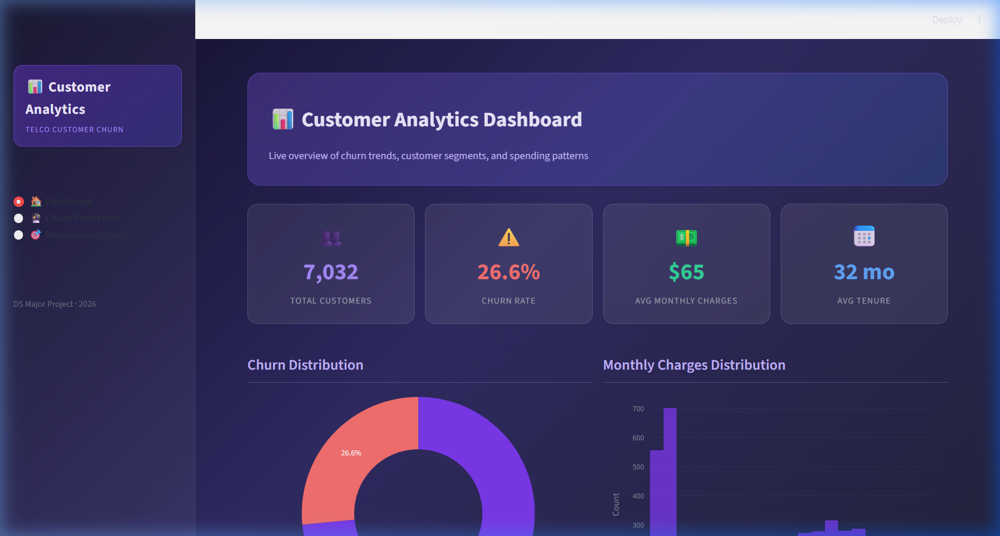
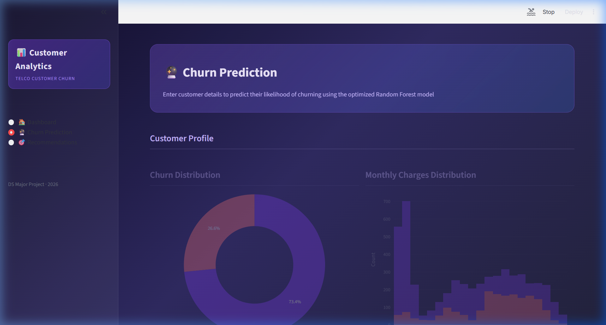
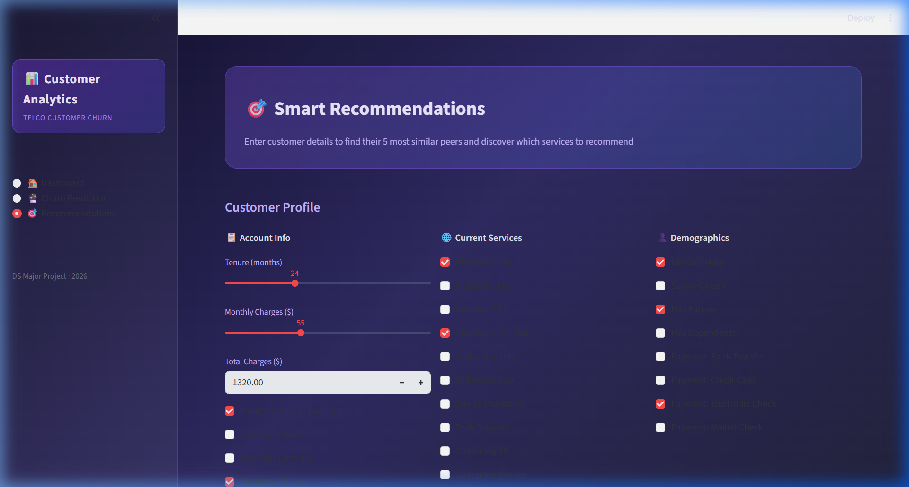

# 📊 Customer Analytics ML Project

> A full end-to-end Data Science project built on the **Telco Customer Churn** dataset — from raw data exploration to an interactive Streamlit web application.

[](https://your-app-name.streamlit.app)


---

## 🚀 Live Demo

🔗 **[Try the App on Streamlit Cloud →](https://your-app-name.streamlit.app)**

---

## 📸 Screenshots

### 🏠 Dashboard


### 🔮 Churn Prediction


### 🎯 Recommendations


---

## 🧩 Project Overview

This project solves **three core business problems** for a telecom company using machine learning:

| Problem | Type | Model Used |
|---|---|---|
| 🔴 Will this customer churn? | Classification | Random Forest (optimized) |
| 💵 How much will they spend? | Regression | Random Forest Regressor |
| 👥 What services to recommend? | Similarity | KNN (Cosine Distance) |

---

## 🗂️ Project Phases

| Phase | Description | Status |
|---|---|---|
| Phase 1 | Problem Understanding & Dataset Setup | ✅ Done |
| Phase 2 | Data Cleaning & Preprocessing | ✅ Done |
| Phase 3 | Exploratory Data Analysis (EDA) | ✅ Done |
| Phase 4 | Feature Engineering | ✅ Done |
| Phase 5 | Model Building & Evaluation | ✅ Done |
| Phase 6 | Customer Segmentation (K-Means) | ✅ Done |
| Phase 7 | AI Recommendation System (KNN) | ✅ Done |
| Phase 8 | Deep Learning — Neural Networks (MLP) | ✅ Done |
| Phase 9 | Model Evaluation & Optimization | ✅ Done |
| Phase 10 | Interactive UI (Streamlit) | ✅ Done |
| Phase 11 | Deployment & Final Touch | ✅ Done |

---

## 🧠 Key Findings

- **26.6%** churn rate across 7,032 customers
- **Tenure**, **TotalCharges**, and **MonthlyCharges** are the top 3 predictors of churn
- Customers on **month-to-month contracts** with **fiber optic** internet churn the most
- Optimized Random Forest achieved **80.16% accuracy** after GridSearchCV tuning
- PCA reduced features to **17 components** while retaining 95% of variance

---

## 🏗️ Project Structure

```
📁 Customer-Analytics-ML-Project/
├── 📄 app.py                    # Streamlit app entry point
├── 📁 pages/
│   ├── dashboard.py             # Dashboard page (KPIs + charts)
│   ├── prediction.py            # Churn prediction page (RF model)
│   └── recommendation.py       # Recommendations page (KNN)
├── 📁 data/
│   ├── cleaned_data.csv         # Preprocessed dataset
│   ├── segmented_customers.csv  # K-Means cluster results
│   └── customer_recommendations.csv
├── 📁 visualizations/           # Saved matplotlib/seaborn plots
├── 📁 screenshots/              # App screenshots for README
├── 📄 preprocessing.py          # Data cleaning & feature engineering
├── 📄 eda.py                    # Exploratory data analysis
├── 📄 models.py                 # Phase 5: Baseline ML models
├── 📄 segmentation.py           # Phase 6: K-Means clustering
├── 📄 recommendations.py        # Phase 7: KNN recommendation system
├── 📄 neural_networks.py        # Phase 8: MLP neural network
├── 📄 optimization.py           # Phase 9: GridSearchCV + PCA + CV
├── 📄 statistical_analysis.py   # Statistical tests & conclusions
├── 📄 requirements.txt          # Python dependencies
└── 📄 README.md
```

---

## ⚙️ Tech Stack

| Category | Libraries |
|---|---|
| Data Manipulation | `pandas`, `numpy` |
| Machine Learning | `scikit-learn` |
| Deep Learning | `sklearn.neural_network` (MLP) |
| Visualization | `matplotlib`, `seaborn`, `plotly` |
| Web App | `streamlit` |

---

## 🔧 Run Locally

### 1. Clone the repository
```bash
git clone https://github.com/Roshan192004/Customer-Analytics-ML-Project.git
cd Customer-Analytics-ML-Project
```

### 2. Install dependencies
```bash
pip install -r requirements.txt
```

### 3. Launch the app
```bash
streamlit run app.py
```

Open **http://localhost:8501** in your browser.

---

## 📊 Model Performance

| Model | Accuracy | Precision | Recall | F1-Score |
|---|---|---|---|---|
| Logistic Regression | ~0.80 | ~0.65 | ~0.54 | ~0.59 |
| Random Forest | ~0.79 | ~0.63 | ~0.49 | ~0.55 |
| Neural Network (MLP) | ~0.80 | ~0.65 | ~0.53 | ~0.58 |
| **RF (Optimized)** | **0.8016** | — | — | — |

---

## 🌐 Deploy on Streamlit Cloud

1. Push code to GitHub (already done ✅)
2. Go to [share.streamlit.io](https://share.streamlit.io)
3. Click **"New app"** → Connect your GitHub repo
4. Set **Main file path** to `app.py`
5. Click **Deploy!**

---

## 📁 Dataset

The [Telco Customer Churn Dataset](https://raw.githubusercontent.com/treselle-systems/customer_churn_analysis/master/WA_Fn-UseC_-Telco-Customer-Churn.csv) contains **7,043 rows** and **21 columns** covering customer demographics, services, account info, and churn labels.

---

## 👨‍💻 Author

**Roshan** — DS Major Project (2026)  
GitHub: [@Roshan192004](https://github.com/Roshan192004)
